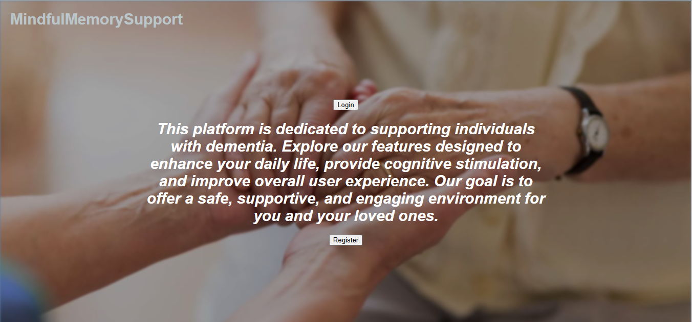
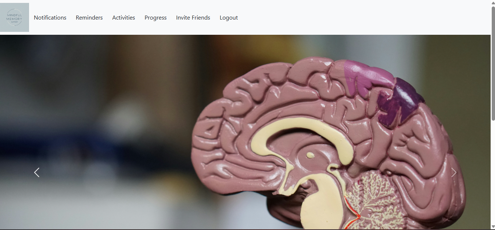
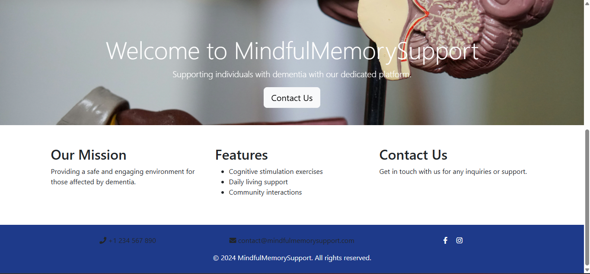
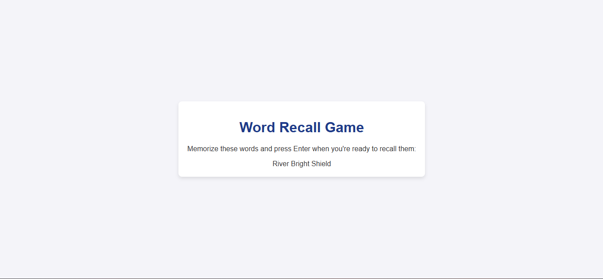
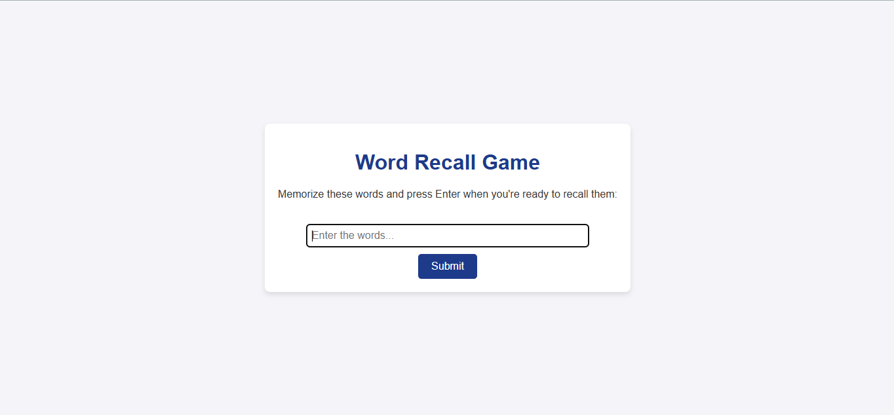
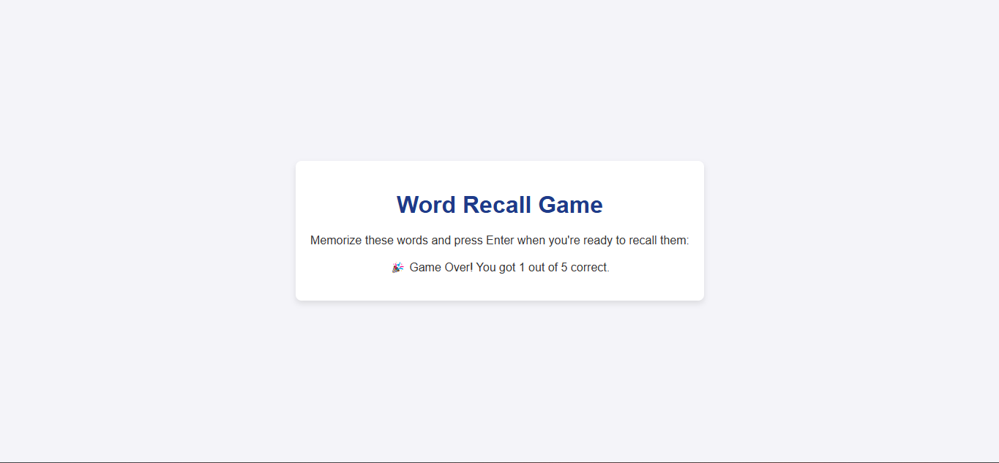
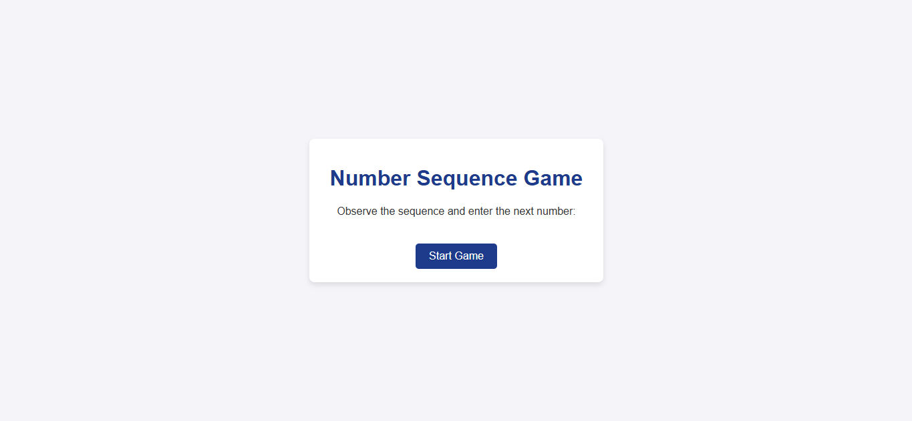
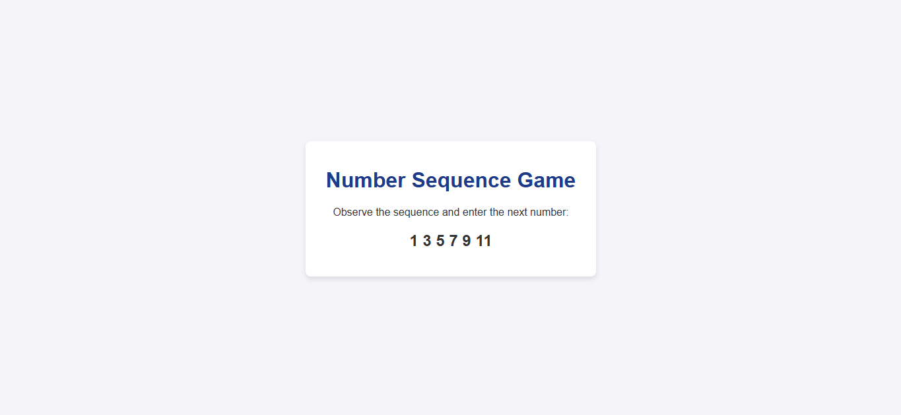

# Mindful Memory Support (MyFlaskProject1)

A dementia support website built with Flask, JavaScript, HTML, CSS, and Bootstrap.

## About the Project
Mindful Memory Support is a web application designed to assist dementia patients in managing their daily tasks and monitoring cognitive abilities. The project aims to provide an interactive platform where patients can set reminders and play cognitive games, with optional assistance from caregivers.

## Features
- **Task Reminders**: Allows users to set daily reminders for important activities.
- **Cognitive Games**: Includes basic games like Word Recall and Number Sequence to help monitor cognitive abilities. *(Note: These games are still in the early stages of development, with standard functionality and will undergo further improvements.)*
- **Self-Reflection Section**:Currently in development tis feature uses a Python-based NLP model to analyze user input about their feelings and provide relevant feedback or reading suggestions.
- **Bootstrap Styling**: Utilizes Bootstrap for a clean and responsive design.
- **Flask Backend**: Handles game logic and interactions.

## Future Enhancements
- **User Authentication**: Secure login and account management.
- **Database Integration**: Store user progress and preferences.
- **Enhanced Cognitive Games**: Improve interactivity and complexity of existing games.
- **Deployment**: Currently for local development only; a deployment plan is in progress.

## Why I Built This
As a fresh software engineering graduate, I wanted to work on a project that combined **Python, Flask, JavaScript, and Bootstrap** while also making a meaningful impact. Mindful Memory Support is an opportunity to apply my skills in **web development, interactivity, and machine learning** to create something beneficial for dementia patients and their caregivers.

## Technologies Used
- **Front-End**: HTML, CSS, Bootstrap, JavaScript
- **Back-End**: Python, Flask
- **Machine Learning**: NLP for sentiment-based recommendations *(under development)*
- **Version Control**: Git, GitHub

## Installation & Setup
### Prerequisites
Ensure you have **Python** installed. You can check by running:
```sh
python --version
```

### Clone the Repository
```sh
git clone https://github.com/WG-19/MyFlaskProject1.git
cd MyFlaskProject1
```

### Install Dependencies
Run the following command to install required Python packages:
```sh
pip install -r requirements.txt
```

### Run the Application
```sh
python app.py
```
Then, open `http://127.0.0.1:5000/` in your browser.

## Screenshots

### Welcome Page  
  

### Homepage  
  
  

### Word Recall Game  
  
  
  

### Number Sequence Game  
  


## Contribution
Currently, this project is in development, but contributions and feedback are welcome!

## License
This project is open-source and available under the [MIT License](LICENSE).

